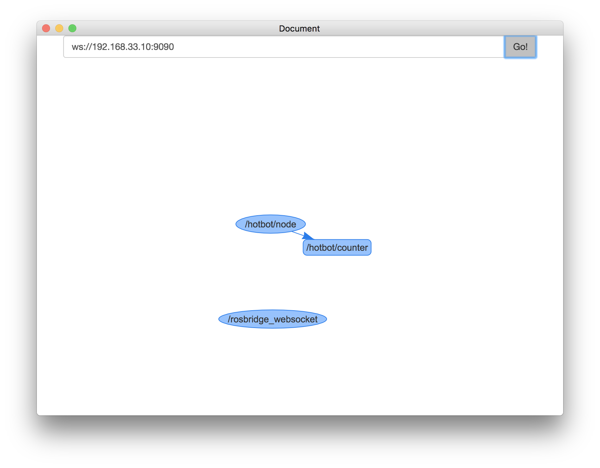

# RosLibJS Graph

This is an electron and web tootls to automatically draw the ROS Graph resorting
on roslibjs ans RosBridge.



## Usage

```bash
$ npm install
$ npm run electron
```

Check that the IP in `index.ts` match your rosbridge server.
